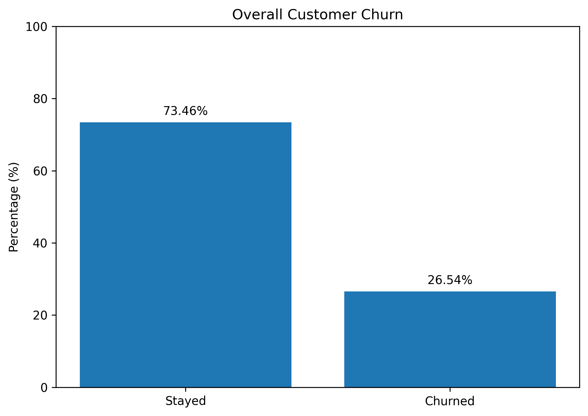
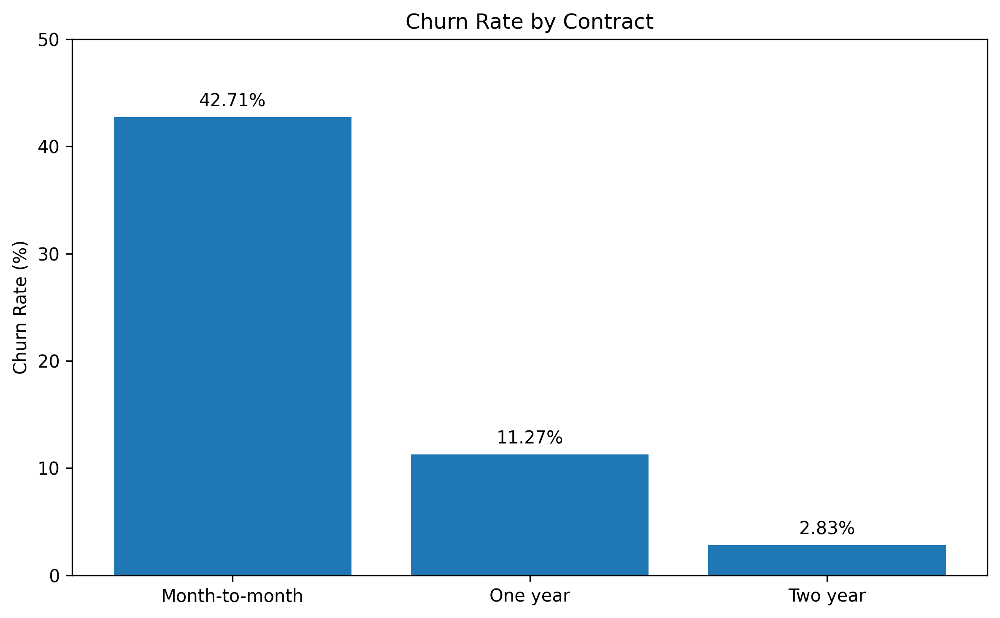
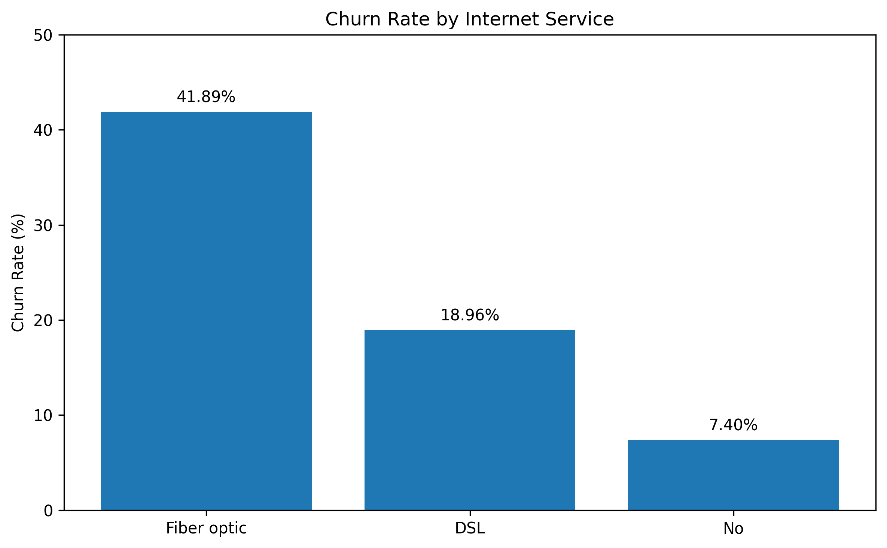

# Telco Customer Churn Analysis


 


## Overview

This project analyzes customer churn in a telecommunications company to
identify the customer segments and service characteristics most strongly
associated with customer attrition.

The project combines **SQL, Python and Power BI** in an end-to-end
analytics workflow, from data preparation and exploratory analysis to
business insights and interactive reporting.

## Business Objective

The analysis was designed to answer key business questions:

-   What is the overall customer churn rate?
-   Which contract types have the highest churn?
-   How does churn vary by internet service?
-   Is customer tenure associated with churn?
-   Which customer segments represent the greatest retention
    opportunity?
-   What actions could help reduce customer attrition?

## Executive Summary

The dataset contains **7,043 customers**, of whom **1,869 have
churned**, resulting in an overall churn rate of approximately
**26.5%**.

The analysis highlights three major patterns:

-   **Contract type is a strong churn indicator.** Month-to-month
    customers show substantially higher churn than customers on one- or
    two-year contracts.
-   **Fiber optic customers have the highest churn among
    internet-service groups**, making this segment a key area for
    investigation and retention actions.
-   **Customers with shorter tenure are more likely to churn**,
    indicating that the early stages of the customer relationship
    represent an important retention window.

These findings suggest that retention strategies should prioritize
customers with short tenure, month-to-month contracts and higher-risk
service profiles.

## Key Insights

### 1. Contract type

Customers on **month-to-month contracts** present the highest churn
rate, while customers with longer-term contracts show considerably lower
churn.

This indicates that contract commitment is strongly associated with
customer retention and represents a potential opportunity for targeted
loyalty or contract-conversion strategies.

### 2. Internet service

**Fiber optic** customers show the highest churn rate among the main
internet-service categories.

This finding suggests that the business should investigate factors such
as pricing, service experience, perceived value and technical issues
within this customer segment.

### 3. Customer tenure

Churn is concentrated among customers with **shorter tenure**, while
customers who remain longer with the company tend to show lower
attrition.

The first months of the customer lifecycle therefore represent an
important period for onboarding, engagement and proactive retention.

### 4. Contract + Internet Service

The combined analysis provides additional segmentation detail. For
example, some long-term-contract segments have substantially lower churn
rates, while month-to-month segments remain more exposed.

The dashboard includes the combined analysis to help identify specific
customer profiles rather than relying only on individual variables.

## Dashboard

The Power BI dashboard was designed to provide an executive view of
customer retention and allow users to explore churn by customer and
service characteristics.

Main KPIs and analyses include:

-   **Total Customers:** 7,043
-   **Churned Customers:** 1,869
-   **Active Customers:** 5,174
-   **Overall Churn Rate:** \~26.5%
-   Churn by Contract
-   Churn by Internet Service
-   Churn by Tenure
-   Churn by Contract + Internet Service
-   Customer segmentation

### Dashboard visuals







## Business Recommendations

Based on the analysis, the following actions could be considered:

1.  **Prioritize month-to-month customers** for targeted retention
    campaigns and incentives to move toward longer-term contracts.
2.  **Investigate the Fiber Optic segment** to understand whether churn
    is related to price, service quality, customer experience or
    perceived value.
3.  **Strengthen early-lifecycle retention**, particularly during the
    first months after acquisition.
4.  **Use customer segmentation** to target retention actions rather
    than applying the same strategy to all customers.
5.  **Monitor churn KPIs continuously** through Power BI to identify
    changes in customer behavior and evaluate retention initiatives.

## Analysis Workflow

The project follows an end-to-end data analytics process:

``` text
Raw Data
   ↓
Data Quality Review
   ↓
SQL Analysis
   ↓
Python / Exploratory Data Analysis
   ↓
Customer Segmentation
   ↓
Power BI Dashboard
   ↓
Business Insights & Recommendations
```

## Tools & Technologies

  Tool                       Purpose
  -------------------------- -------------------------------------------
  **Python**                 Data analysis and exploratory analysis
  **Pandas**                 Data manipulation and transformation
  **Matplotlib / Seaborn**   Data visualization
  **SQL**                    Data querying and segmentation
  **SQLite**                 Local analytical database
  **Power BI**               Interactive dashboard and KPI reporting
  **Jupyter Notebook**       Storytelling and analytical documentation
  **Git / GitHub**           Version control and project portfolio

## Project Structure

``` text
customer-churn-analysis/
│
├── README.md
│
├── data/
│   └── WA_Fn-UseC_-Telco-Customer-Churn.csv
│
├── database/
│   └── customer_churn.db
│
├── images/
│   ├── churn_by_contract.png
│   ├── churn_by_internet_service.png
│   ├── churn_by_tenure.png
│   ├── churn_contract_internet.png
│   ├── churn_contract_tenure.png
│   └── churn_overall.png
│
├── powerbi/
│   ├── customer_churn_final.csv
│   └── Telco Customer Churn.pbix
│
├── sql/
│   └── customer_churn_analysis.sql
│
└── storytelling/
    └── customer_churn_storytelling.ipynb
```

## Project Files

-   [Power BI Dashboard](powerbi/Telco%20Customer%20Churn.pbix)
-   [SQL Analysis](sql/customer_churn_analysis.sql)
-   [Storytelling
    Notebook](storytelling/customer_churn_storytelling.ipynb)
-   [Source Dataset](data/WA_Fn-UseC_-Telco-Customer-Churn.csv)

## Skills Demonstrated

This project demonstrates practical experience in:

-   Data Cleaning
-   Exploratory Data Analysis
-   SQL
-   Python
-   Pandas
-   Data Visualization
-   Power BI
-   KPI Development
-   Customer Segmentation
-   Churn Analysis
-   Business Intelligence
-   Data Storytelling
-   Business Recommendations

## Author

**Fabian Medina**

Data Analyst \| Python \| SQL \| Power BI \| Tableau

[Portfolio](https://fabiancms.github.io/) ·
[GitHub](https://github.com/fabiancms)
